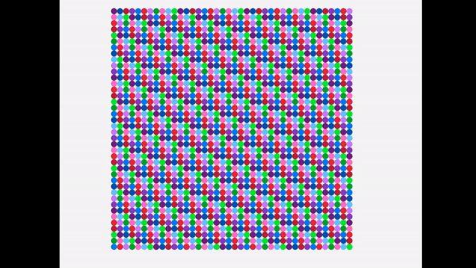

# Bounce

A first approach to simulating cloth. It models cloth as a bunch of nodes connected by springs and atracted by gravity to the floor.  

## Features:
 * Runge Kutta 4 solver  
 * Raylib to display the 2D results.  
 * Runs in real time. (At least for 40x40 = 1600 nodes).  

## To improve:
 * Spring's rest length is zero. This makes the cloth want to collapse on itself.  
 * The code is really ugly. A new more clear way of handeling interactions is needed.  
 * Add a way to interact with the cloth while the program is running.  
 * Try to make it 3D  

## Output:

Output of the cloth simulation. The cloth is only supported by the top corners.
